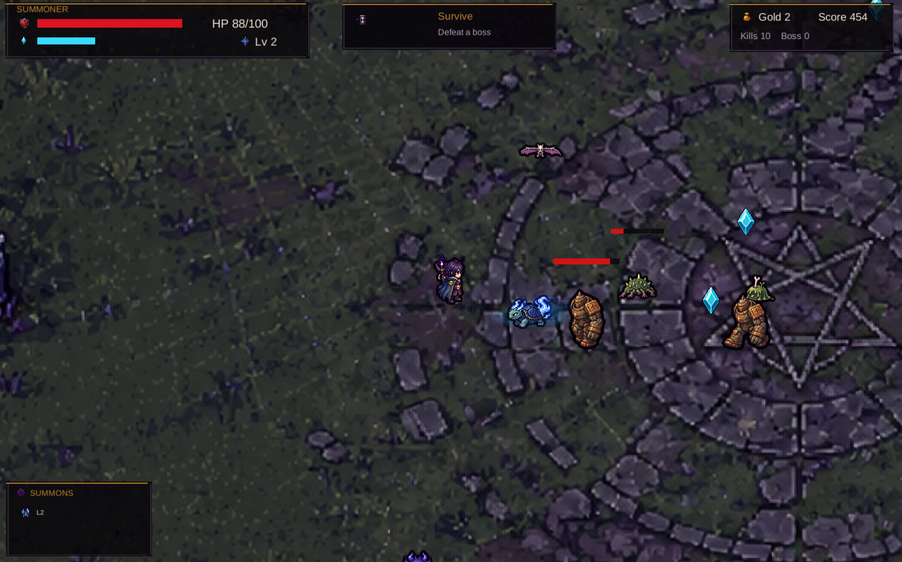
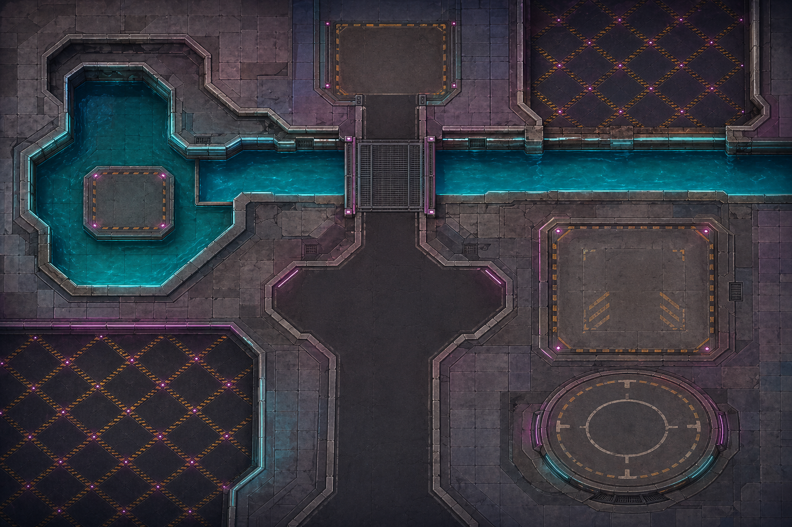
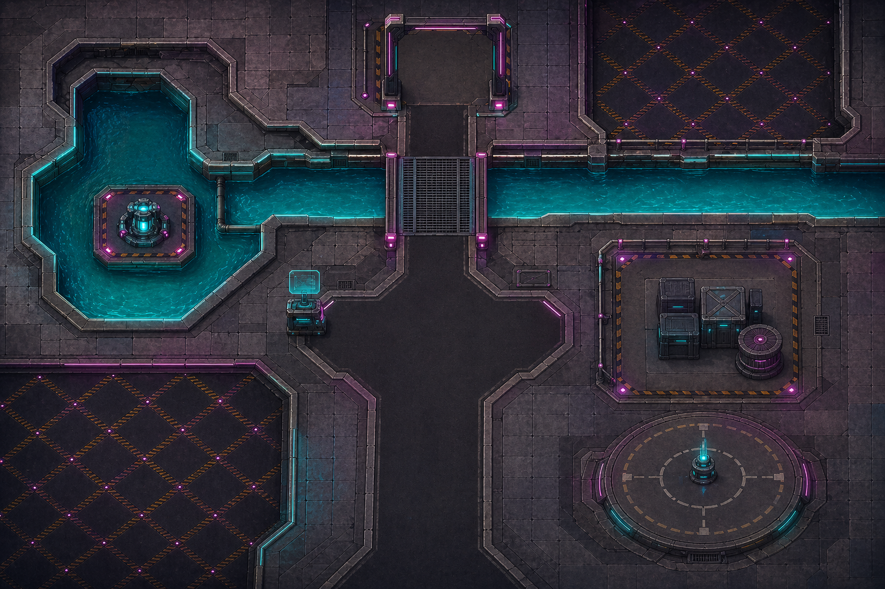
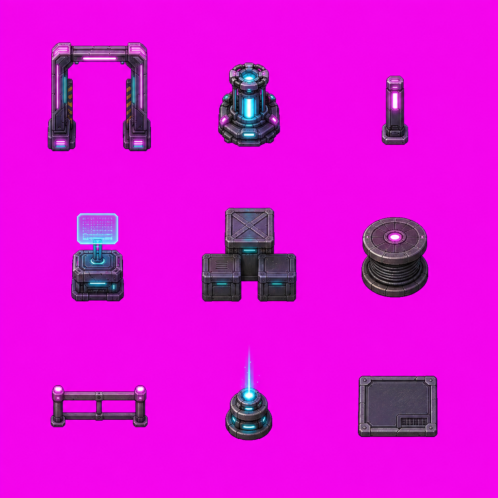

# Agent Sprite Forge（中文适配版 · Lovart + 即梦 Dreamina 接入）

> ⚠️ 本仓库基于 [0x0funky/agent-sprite-forge](https://github.com/0x0funky/agent-sprite-forge) 改造。下方「更新说明」为本仓库相对原版的改动，**写在最前面**；其后是原仓库简体中文自述全文。

## 更新说明（Update Notes）

本仓库将原本依赖 Codex / Grok 内置 `image_gen` / `image_to_video` 的三个技能，改为接入 **Lovart**（HMAC-SHA256 AK/SK 签名后端，密钥存于 `~/.workbuddy/config/lovart.json`）与 **即梦 Dreamina CLI**（已装于 `~/bin/dreamina.exe`），并强制加入「生图 / 视频前费用告知」规则。

### 1. `generate2dmap`（地图生成）
- 图像生成后端：由 Codex/Grok 内置 `image_gen` → **Lovart 后端（首选）或 即梦 Dreamina CLI**
- 新增「Backend Selection & Cost Notification」章节：每次生图前必须告知用户 ① 用哪个后端 ② 模式（fast=扣信用点 / unlimited=免费排队）③ 生成内容 ④ 预计费用，并等待确认
- 参考图传递由 `view_image` 工具改为直接展示图片附件
- 本地脚本（extract_terrain_tiles / extract_prop_pack / compose_layered_preview）不变

### 2. `generate2dsprite`（精灵图 / 动画表）
- 图像生成后端：同上，由 `image_gen` → **Lovart / 即梦 CLI**
- 新增「Image Generation Backend」章节与同样的费用告知强制规则
- 锚点图 / 布局图由交给 `image_gen` 改为交给 Lovart / 即梦
- 本地后处理脚本（generate2dsprite.py / make_anchor_layout / make_layout_guide）不变

### 3. `video2dsprite`（视频 → 精灵，改动最大）
- 移除 "Grok Build only" 限制
- 视频生成：由 Grok `image_to_video` → **即梦 Dreamina CLI 的 `image2video` / `multiframe2video`**
- Base still：由 Grok `image_gen`/`image_edit` → **Lovart 或 `dreamina text2image` / `dreamina image2image`**
- 新增 Dreamina CLI 前置条件检查（安装 / 登录 / 余额）与费用告知规则
- 本地后处理管线（ffmpeg 抽帧 → 洋红 chroma key → 采样归一化）完全不变
- **（本次更新）Step 0 交互式生成方式选择**：运行前先询问用户用「首尾帧模式」（`frames2video`，首 / 尾帧需用户确认路径；循环动画时首帧 = 尾帧同图）还是「全能模式」（`image2video` / `multimodal2video`，参考图驱动），并从模型表选即梦模型（默认 `seedance2.0_vip` 720p 6s）。
- **（本次更新）暖色自动绿幕 `keycheck`**：品红抠像前先检测角色 / 物体是否含红 / 品红 / 紫等暖色；含则改用绿幕 `#00FF00`，否则保持品红 `#FF00FF`。脚本新增 `keycheck` 子命令，`chroma_key_rgba` 支持 `--key-color magenta|green|auto`（`auto` 从原始帧四角自动识别）。实测猫猫村手动猫：黑 / 白猫因粉脸颊 / 鼻 → 绿幕，蓝猫 → 品红。
- **（本次更新）新增 `robust_key_rgba` 鲁棒抠像**：处理 Dreamina 首尾帧 / image2video 输出中背景色不统一、或在品红 ↔ 绿幕过渡中出现 desaturated 粉紫/灰调的问题。该函数从每帧四角采样实际背景色，同时 key 纯品红、纯绿、及四角颜色，再洪泛填充连通背景并柔化边缘，避免固定 key 漏底。在猫猫村白猫 sleep→lift 序列中清除了中间帧的粉紫残留。

### 4. `cocos2d-atlas-builder`（图集打包 + 标准 Cocos2d plist，新增）
- 新增纯本地技能（Python + Pillow，无生图后端）：把**有序透明 PNG 帧**打包成方形透明图集（N×N 网格，4×4=16 / 8×8=64 帧），并生成**严格对齐 Free Texture Packer Cocos2d 模板**的 `.plist`。
- plist 模板要点（实测可导入 Cocos Creator）：DOCTYPE `-//Apple Computer//DTD PLIST 1.0//EN`、`format=2`、`pixelFormat=RGBA8888`、`premultiplyAlpha`、2 空格缩进、rect 字符串无空格（`{{0,0},{256,256}}`）。详见 `skills/cocos2d-atlas-builder/references/cocos2d_plist_spec.md`。
- 含脚本 `build_atlas.py` / `gen_plist.py` / `make_preview_gif.py` 与 `tests/test_cocos2d_atlas_builder.py`。

### 5. `ps-batch-png8-usm-export`（PNG 图集批量 USM 锐化 + 8 位压缩，新增）
- 新增纯本地技能（依赖 Photoshop MCP `@alisaitteke/photoshop-mcp`，无生图后端）：把指定文件夹的 PNG（如 `*_atlas_4x4.png`）逐一在 Photoshop 中打开，应用 Unsharp Mask 锐化，再用 Save-for-Web **PNG-8（较小文件 / 8 位）** 重新导出，保留透明，显著缩小游戏图集体积。
- 实现要点：MCP 的 `photoshop_export_as` 未暴露「较小文件（8位）」勾选项，故改用 `photoshop_execute_script` 走 ExtendScript `ExportOptionsSaveForWeb`（PNG8=true、transparency=true）。默认 USM 参数 amount=100 / radius=1.0 / threshold=0，可按需调整。
- 实测：18 张 `_atlas_4x4` 图集 16.45 MB → 5.04 MB（节省 ~69%）。
- 单文件 `SKILL.md` 即工作流说明，无附带脚本。

### 6. `html-game-to-cocos`（HTML 游戏 → Cocos 可视化可替换工程流水线，新增）
- 新增纯方法论技能（单文件 `SKILL.md`，无脚本依赖）：把**单文件 HTML/Canvas2D 游戏**移植为 **Cocos Creator 工程**，核心产出不是"能跑就行"，而是**编辑器里全部元素可视化、素材即拖即换**的可编辑工程。
- **六步流水线**：① 矢量忠实移植（Canvas 语义包装器保 H5 坐标系，逐函数对应，参数全 `@property` 曝出）→ ② MCP 节点实体化（运行时黑盒 → 编辑器真实节点）→ ③ MCP 批量建 Sprite 槽位（拖图即替换、无图矢量兜底）→ ④ 动态元素实体化（网格真源节点 / 角色实体 / SpriteAtlas 序列帧）→ ⑤ 迭代调试闭环 → ⑥ 清理 + GUIDE.md 交付。
- **核心机制 Sprite 槽位**：每个界面元素一个约定命名槽位节点（`bg-wall` / `hud-counter-bg` / `button-start`…），Renderer 每帧检查槽位——拖了 PNG 显示图、没拖自动回退代码矢量绘制；换素材零改代码。
- **MCP 全流程驱动**：基于 funplay-cocos-mcp 的 `execute_javascript`，内含双上下文决策表（editor / scene）、一次性批量脚本模式（顶层 return + save-scene）、10 条实战硬约束（装饰器导入、sizeMode、帧序、事件不序列化、@property 数组内联覆盖等）。
- **跨 Agent 通用**：文档为纯 Markdown，任何能连 MCP 的 Agent（WorkBuddy / Trae / Cursor / Claude Code）均可执行；调用方式见仓库内 SKILL.md 开头说明。
- 实战验证：猫猫村 playable ad 项目全流程（HTML 895 行单文件 → 17 个 TS 文件 + 40+ 可替换槽位 + 序列帧图集系统）。

### 7. `seedance-storyboard-prompt`（分镜脚本 → Seedance 提示词流水线，新增）

- 新增纯方法论 + 本地词典技能（单文件 `SKILL.md` 驱动，检索脚本只依赖 Python 标准库，无生图后端）：把**一句话想法 / 粗略剧本**补全为 **Seedance 2.0 可直接跑的分镜提示词**。
- **三阶段不跳步**：阶段零「想法优化」（查库给 2–3 个候选 + 推荐理由 + 改写前后对照，等拍板）→ 阶段一完整分镜脚本（等确认）→ 阶段二拼装提示词。不浪费生成额度。
- **内置 424 条电影技巧库**（抓自 [melies.co](https://melies.co/cinematic-techniques)，13 类：镜头运动 / 灯光 / 构图 / 角度 / 光学 / 色彩 / 时间 / 特效 / 剪辑 / 氛围 / 类型 / 病毒风格），每条含定义、叙事功能、怎么拍、何时用不用、片中实例、**Prompt 模板**、常见错误。写镜头语言前先查库，不凭感觉造词。
- **内置「意图 → 技巧」映射表**：把"压迫感""燃""反转要狠""夜戏火光"这类感觉词翻译成具体词条；配 `scripts/search.py` 检索工具，支持中文意图词 / 英文关键词 / 分类过滤 / 精确取全文。
- **内置 31 条三行式表情词条**（眼部 + 嘴角 + 面部），配情绪递进链（嘲讽冷怒 → 轻柔错愕 → 极致震惊 → 慌张惊恐 → 麻木绝望）。**全流程双写规则**：任何交付物都写 `表情【词条名】——眼部…；嘴角…；面部…`，禁止只写词条名裸奔——模型不认词条名，脚本被直接拿去用时会失效。
- **交付严格两区制**：上「可复制区」（全局锁 + Shot 正文，零备注零元信息）+ 显眼分隔线 + 下「说明区」（技巧依据 / 表情对照 / 参考图挂载 / 执行参数 / 口播对齐 / 字数表 / 自检）。阶段一可复制区与阶段二正文逐字一致。
- **字数硬上限 2000 字**（Seedance 平台规则）：计量单位是「全局锁 + 目标 Shot 正文」一段，目标 ≤1800；压缩顺序：先压全局锁 → 再压正文次要修饰 → 同期声留 3–5 条 → 仍超拆镜；绝不删表情三维度 / 机位数值 / 景深焦点 / 环境光照 / 弹窗原文。配 `scripts/count_chars.py` 逐段自检。
- **资产锚定二分法**：先问用户哪些资产有图 → 有图写「（图片 N）作为 @角色 的视觉锚定」；无图直接写完整生图提示词（禁止「待补」空引用）。

### 8. `web-ai-pack`（网页 AI 自包含规范包，新增）

给豆包 / Gemini / ChatGPT / Kimi 这类**装不了 skill、跑不了脚本**的网页版 AI 用：把规范、表情库、技巧库、示例全部塞进文件，技巧检索从「跑 `search.py`」改成文档内三段式（意图映射表 → 分类索引 → 词条卡）。导出时自动剔除所有本地路径与脚本命令。

| 文件 | 用途 |
|---|---|
| `00_怎么用.md` | 三种喂法 + 各平台注意 + 验收「三看」 |
| `01_开场指令.txt` | 第一行粘贴的角色 + 执行要求 |
| `02_网页AI规范_完整自包含版.md` | 主文件：规范 + 表情库 31 条 + 167 条技巧卡 + 示例（含说明区节选） |
| `02b_网页AI规范_轻量版.md` | 技巧卡压成一行式，上下文小的模型用 |
| `03_技巧库_全量424条.md` | 可选追加，Gemini 等大上下文模型查冷门词条 |
| `04_字数自检卡.txt` | 单独贴给任意 AI，让它逐段数字符并压到 ≤1800 字 |

重建：`cd web-ai-pack && python _source/build_pack.py`（脚本用相对路径，clone 下来原地可跑；改规范正文编辑 `_source/主体模板.md`，换示例替换 `_source/示例_风云助阵_v2.txt`）。

### 费用告知示例
> 📸 **即将生图** | 后端: **Lovart** (mode: **fast**, 扣信用点) | 内容: [一句话描述] | 预计: ~N 次生成

---

（以下为原仓库简体中文自述 README.zh-CN.md 全文）

# Agent Sprite Forge

语言：[English](./README.md) | [繁體中文](./README.zh-TW.md) | [简体中文](./README.zh-CN.md) | [日本語](./README.ja.md) | [한국어](./README.ko.md)

<p align="center">
  
</p>

<p align="center">
  <strong>面向 Codex 的 2D 游戏资产技能：生成可用的角色精灵、分层地图，以及能交给游戏引擎继续编辑的原型素材。</strong>
</p>

<p align="center">
  用自然语言描述需求，Codex 负责规划资产流程，用内置图像生成产出原始视觉，再用本地处理器去背、切格、对齐、验证，并导出给 Godot、Unity 或普通 2D 游戏项目使用。
</p>

<p align="center">
  <a href="#showcase">Showcase</a> |
  <a href="#included-skills">Skills</a> |
  <a href="#install">Install</a> |
  <a href="#suggested-prompts">Prompts</a> |
  <a href="#star-history">Star History</a>
</p>

## 有什么不同

Agent Sprite Forge 不是一组 prompt 模板。它是一套 Codex-first 的 2D 游戏资产工作流：agent 先判断需要什么资产、图像生成负责创作原始视觉，本地脚本只做可重复的清理、切割、对齐、验证和导出。

<table>
  <tr>
    <td width="25%"><strong>精灵表</strong><br />角色、怪物、NPC、道具、攻击、法术、投射物、命中特效、idle、walk，以及参考图驱动的变体。</td>
    <td width="25%"><strong>分层地图</strong><br />ground-only base、dressed reference、prop pack、透明 props、y-sort 摆放、碰撞、区域和预览图。</td>
    <td width="25%"><strong>引擎交付</strong><br />Godot 场景、可编辑 TileMapLayer、分离式 props、遇怪草丛、碰撞体、出口和 debug player。</td>
    <td width="25%"><strong>本地清理</strong><br />洋红去背、frame extraction、alignment、透明 PNG/GIF 导出、prop pack 切割和 QA metadata。</td>
  </tr>
</table>

## Showcase

### Engine-Ready Prototypes

这些案例使用 Codex 和 `agent-sprite-forge` 工作流组装，重点是完整闭环：生成资产、结构化场景数据，以及可玩的 prototype wiring。

<table>
  <tr>
    <td align="center" width="50%">
      
      <br />
      <strong>Summon Survivors - Unity WebGL</strong>
      <br />
      生成地图、主角 sheet、召唤物、进化、敌人、Boss、拾取物、HUD、FX、升级选项和 WebGL 部署。
      <br />
      <a href="https://summon-survivors.vercel.app/">Play build</a> | <a href="https://drive.google.com/file/d/1TL7qRX95przTToZILVQ1EFwEXm3flB6t/view?usp=sharing">Build conversation</a>
    </td>
    <td align="center" width="50%">
      
      <br />
      <strong>Forest Pass Defense - Godot Tower Defense</strong>
      <br />
      Godot 4 塔防原型，包含地图、分离式 props、塔位、塔、敌人 sheet、Boss、飞行敌、波次、HUD、建造 / 升级 / 出售流程和投射物规则。
    </td>
  </tr>
  <tr>
    <td align="center" width="50%">
      
      <br />
      <strong>Editable RPG Map - Godot TileMap</strong>
      <br />
      图像生成 tileset 和 prop sheet，再接进可编辑 <code>TileMapLayer</code>、<code>Sprite2D</code> props、遇怪草丛 <code>Area2D</code>、<code>StaticBody2D</code> 碰撞、出口、metadata 和 debug player/camera。
    </td>
    <td align="center" width="50%">
      
      <br />
      <strong>Neon Breach - Cyberpunk Side-Scroller</strong>
      <br />
      使用生成的角色、攻击、地图和 gameplay assets 组装出的可玩横向卷轴 prototype。
    </td>
  </tr>
  <tr>
    <td align="center" width="50%">
      
      <br />
      <strong>Sengoku Era - JavaScript monster-taming RPG</strong>
      <br />
      浏览器 RPG prototype，包含生成角色、初始怪物选择、地图流程和战斗 UI。
      <br />
      <a href="https://sengoku-era.vercel.app/">Play build</a>
    </td>
    <td align="center" width="50%">
      
      <br />
      <strong>Starter selection and battle loop</strong>
      <br />
      用 skill workflow 生成 sprite、monster、battle 和 map assets 后完成的小型 JavaScript 游戏展示。
    </td>
  </tr>
</table>

### Sprite Sheets And FX

当你需要动画单位、玩家角色、怪物、props、spell bundles、projectile/impact FX，或参考图驱动的变体时，使用 `$generate2dsprite`。

<table>
  <tr>
    <td align="center" width="25%"><br /><strong>Text to sprite</strong><br />从自然语言生成攻击动画。</td>
    <td align="center" width="25%"><br /><strong>Character action</strong><br />紧凑的 2D 动作 sheet 和透明导出。</td>
    <td align="center" width="25%"><br /><strong>Spell cast</strong><br />适合 bundle 的施法动画。</td>
    <td align="center" width="25%"><br /><strong>Projectile</strong><br />匹配的 projectile / impact workflow。</td>
  </tr>
</table>

### Layered RPG Map Pipeline

当你需要地图而不是单独 sprite 时，使用 `$generate2dmap`。可读性较高的 layered raster map 目前推荐 clean hand-painted HD game-map style：先生成 ground-only base，再生成 dressed reference，接着生成 prop pack，最后做透明 prop extraction 和 layered preview composition。

<table>
  <tr>
    <td align="center" width="33%"><br /><strong>Ground-only base</strong></td>
    <td align="center" width="33%"><br /><strong>Dressed reference</strong></td>
    <td align="center" width="33%"><br /><strong>3x3 prop pack</strong></td>
  </tr>
</table>

<p align="center">
  
  <br />
  <strong>Flattened layered RPG map preview</strong>
</p>

```text
layered_raster + y_sorted_props + precise_shapes + trigger_zones + raw_canvas
```

### Godot Editable TileMap Export

`$generate2dmap` 也可以输出可编辑 Godot map project，而不是只有一张 flattened image。这个 showcase 使用图像生成的 tileset 和 3x3 prop sheet，再接入 Godot 4.5 scene。

<p align="center">
  
  <br />
  <strong>Godot editor scene: editable layers, props, zones, collision, exits, and debug player</strong>
</p>

Godot 输出可以包含可编辑 `TileMapLayer` nodes、独立 `Sprite2D` props、遇怪草丛 `Area2D` zones、`StaticBody2D` collision blockers、exit `Area2D` zones，以及 debug player/camera。

```text
image_gen tileset + prop_pack_3x3 + layered_tilemap + separate_props + trigger_zones + Godot_TileMap
```

## Included Skills

| Skill | 用途 | 输出 | 运行环境 |
| --- | --- | --- | --- |
| [`generate2dsprite`](./skills/generate2dsprite) | Sprites、animation sheets、props、spell bundles、FX、参考图变体、固定 frame sheet 的 layout guide | raw sheet、cleaned transparent sheet、frames、GIFs、metadata | Codex / Grok |
| [`generate2dmap`](./skills/generate2dmap) | baked maps、layered raster maps、clean HD RPG maps、prop packs、collision/zones、Godot-editable scenes、side-scroll/parallax scenes | base map、dressed/stage reference、prop pack、extracted props、preview、scene metadata | Codex / Grok |
| [`video2dsprite`](./skills/video2dsprite) | **视频驱动的更密动作 sprite**：静帧 → `image2video`/`frames2video` → 抽帧 → 品红/绿幕抠图（暖色自动绿幕） → 多密度 strip/GIF | video、frames、8/16/24/48 sprites | 即梦 Dreamina CLI |
| [`cocos2d-atlas-builder`](./skills/cocos2d-atlas-builder) | **有序透明帧 → 方形图集 + 标准 Cocos2d plist**：N×N 网格打包（4×4=16 / 8×8=64）→ `.atlas` → 严格对齐 Free Texture Packer 的 `.plist`（format=2、RGBA8888、premultiplyAlpha，无空格 rect） | 方形透明图集 PNG、`.atlas`、逐帧 `frames/`、播放 GIF、`cat_*.plist` | Python + Pillow（纯本地，无生图后端） |
| [`ps-batch-png8-usm-export`](./skills/ps-batch-png8-usm-export) | **PNG 图集批量压缩**：逐张 Photoshop 打开 → USM 锐化 → 8 位 PNG（PNG-8 / 较小文件）重导出，保留透明 | 压缩后的 PNG（目录结构镜像原图） | Photoshop MCP（`@alisaitteke/photoshop-mcp`，纯本地） |
| [`seedance-storyboard-prompt`](./skills/seedance-storyboard-prompt) | **分镜脚本 → Seedance 提示词流水线**：想法优化提案 → 完整分镜脚本 → 可复制提示词；内置 424 条电影技巧库 + 31 条表情词条 + 意图映射表 | 提案表、分镜脚本、整段可复制的 Shot 提示词块 | Python 标准库（纯本地，无生图后端） |

> **`$video2dsprite` 需要即梦 Dreamina CLI**（`image2video` / `frames2video`）。安装到 `~/.workbuddy/skills` 或 `~/.grok/skills`。追求硬像素生产 sheet 仍优先 `$generate2dsprite`。

`$generate2dmap` 只有在地图流程需要可复用透明 props 时，才会搭配 `$generate2dsprite`。小型环境 props 可以批成 `2x2`、`3x3` 或 `4x4` prop packs，再切成独立透明 props。平台、地板、桥、墙、门和长条 hazard 这类碰撞关键物件，通常应该单独生成或用 tile/object layer 表达。

## How It Works

1. 用户请 Codex 生成 sprite、prop pack、map 或 engine-ready prototype。
2. Agent 判断 asset type、action、bundle shape、sheet layout、frame count、style 和 alignment strategy。
3. 内置图像生成产出 raw visual asset。
4. 本地脚本做 deterministic post-processing：chroma-key cleanup、despill、frame extraction、alignment、prop-pack slicing、GIF/PNG export 和 validation metadata。
5. 对地图和 prototype，Codex 也可以组装 placement metadata、collision、trigger zones、Godot scenes 或 Unity project wiring。

脚本不是创意大脑。Agent 负责视觉和 pipeline 决策；Python 工具只做可重复的像素处理和导出。

## Install

### Windows PowerShell

```powershell
git clone https://github.com/0x0funky/agent-sprite-forge.git
cd .\agent-sprite-forge
python -m pip install -r .\requirements.txt
New-Item -ItemType Directory -Force -Path "$env:USERPROFILE\.codex\skills" | Out-Null
Copy-Item -Recurse -Force `
  ".\skills\*" `
  "$env:USERPROFILE\.codex\skills\"
```

### macOS / Linux

```bash
git clone https://github.com/0x0funky/agent-sprite-forge.git
cd ./agent-sprite-forge
python3 -m pip install -r ./requirements.txt
mkdir -p ~/.codex/skills
cp -R ./skills/* ~/.codex/skills/
```

安装后请重开 Codex session，让 skills 被干净载入。

## Suggested Prompts

### Sprite

```text
Use $generate2dsprite to create a 3x3 idle for an ultimate earth titan.
```

```text
Use $generate2dsprite to create a side-view lightning knight attack animation.
```

```text
Use $generate2dsprite to create a wizard spell bundle with cast, projectile, and impact sprites.
```

### Map

```text
Use $generate2dmap to create a Godot-editable RPG map with separated props, encounter grass Area2D zones, collision StaticBody2D blockers, exit zones, and a debug player scene.
```

```text
Use $generate2dmap to create a playable side_scroll_mode platformer stage with parallax layers, stage-reference, separate platform_objects, collision metadata, camera bounds, and a stage-preview.
```

### Storyboard / Seedance Prompt

```text
Use $seedance-storyboard-prompt to turn this rough idea into a 40s, 8-shot Seedance storyboard with camera, lighting and expressions filled in.
```

```text
Use $seedance-storyboard-prompt to optimize this想法：主角在帐里跟周瑜吹牛说要搞百万支箭，周瑜不信，结果真搞来了。吹牛那段要拽，打脸那段要爽。
```

```text
Use $seedance-storyboard-prompt to pick the right camera technique for a betrayal reveal — give me 3 candidates and why.
```

## What You Get

典型 sprite sheet 输出：

- `raw-sheet.png`
- `raw-sheet-clean.png`
- `sheet-transparent.png`
- frame PNGs
- `animation.gif`
- `prompt-used.txt`
- `pipeline-meta.json`

地图输出取决于 pipeline：

- Single baked map：完整地图图像、可选 prompt file、可选 collision metadata。
- Layered raster map：base map、dressed reference、prop folders 或 prop-pack extraction manifest、prop placement metadata、collision/zones metadata、flattened layered preview。
- Side-scroll map：parallax layers、stage reference、separate platform/object assets、objects/collision metadata、camera bounds、stage preview。
- Godot editable map：tileset/prop assets、scene files、layer metadata、collision/zones、exits、debug player setup。

## Notes

- 最好的结果来自明确指定视角、动作和动作节奏的 prompt。
- 大型 creature 通常更适合 `3x3 idle`。
- 小型 spell、projectile 和 impact 通常适合 `2x2` 或 `2x3`。
- 主角攻击、射击、施法动作建议 body-only；大范围 slash、muzzle flash、projectile、impact 独立生成成 FX。
- 商业项目请优先使用原创角色或你拥有权利的 IP。

## Star History

<a href="https://www.star-history.com/?repos=0x0funky%2Fagent-sprite-forge&type=date&legend=top-left">
 <picture>
   <source media="(prefers-color-scheme: dark)" srcset="https://api.star-history.com/chart?repos=0x0funky/agent-sprite-forge&type=date&theme=dark&legend=top-left" />
   <source media="(prefers-color-scheme: light)" srcset="https://api.star-history.com/chart?repos=0x0funky/agent-sprite-forge&type=date&legend=top-left" />
   
 </picture>
</a>

## License

MIT. See [LICENSE](./LICENSE).
